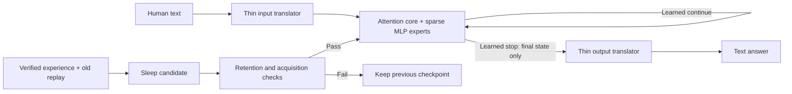

# Premonition: end-to-end execution board

Started 2026-09-30 02:32 UTC (September 29, 10:32 p.m. New York).
Owner: lead coordinator. Implementation and experiments: Sol subagents.

The complete objective is **NOT SHOWN**. This board does not promote development
screens or carry old approvals forward. The user's current design and evidence
rules override older handoff notes.

## Deadline update from Ben

Deliver a runnable joined **proof of concept by 2026-09-30 07:00 America/New_York
(11:00 UTC)**. The heart is a non-English latent-state looped reasoner, notebook,
and actual overnight learning. This version deadline does not imply completion
of the full research proof or public benchmark race. Build and run the vertical
path first; retain every unpassed research gate explicitly. The lead directs and
verifies Sol work, rather than absorbing implementation from the workers.

Ben confirms his RTX 5070 Ti is reachable through Tailscale. Prefer that free
GPU for small tests. $7.50 is the total rental budget for this proof of concept;
additional funding comes after delivery. At account usage below 3% remaining,
Ben authorizes applying his available reset through supported account controls.
Initial usage check: 76% remaining, one full reset available; not redeemed.

### Release checks for the 7 a.m. version

1. A documented local command loads actual saved weights and accepts text.
2. The reasoner loops in latent state, uses a learned stop with an enforced cap,
   and passes only final state to the output translator. No language-model or
   hand-written solver silently substitutes for the reasoner.
3. A persistent notebook reaches the reasoner; the output translator cannot read
   it independently. A memory-removal control establishes whether it is used.
4. A real sleep job updates a checkpoint using allowed experience and replay;
   fresh before/after checks record new competence and old-skill retention.
   Failed candidates roll back. No gain is promised ahead of the run.
5. Two seeds and independent recount back any claimed behavioral improvement.
   A working interface alone is labelled an engineering result.
6. One model bundle, a run guide, raw evidence and a visual status report are
   committed to main. Scope limits and all failed gates remain prominent.

Ben clarified: **grammatically correct conversational sentences are required**;
symbolic-only input/output is not the requested version. Beating other models on
equal benchmarks for its scale is also a target. The comparison must disclose
the whole system's total and active parameters, including any pretrained language
component, and equal inputs/tools/budgets. A pretrained talker must not bypass
the latent reasoner. Unsupported wins or grammatical examples alone do not pass.

An overnight heartbeat is scheduled every 15 minutes in this chat to resume
coordination if needed and report meaningful changes. It must report readiness
and any unmet requirements by the deadline, then pause its recurring schedule.

### Later capabilities and optional experiments

Ben explicitly wants **audio and vision eventually**. They belong on the later
roadmap, outside tonight's required text proof of concept: thin modality
translators feed the same latent reasoner. Video is a possible extension.

The additional pictured ideas are optional, adopted only if they help: a creative
proposal-and-filter mechanism; tools/agentic jobs on request; a skills notebook;
idle curiosity and assigned-topic web research. None licenses a second model to
do the reasoner's job, unchecked web text to become trusted memory, or generated
prose to become training data. Quarantine external material, retain sources, and
test usefulness before adding complexity. These ideas do not displace tonight's
conversation, reasoner, notebook, sleep and fair-comparison work.

**Priority research update:** Ben specifically asks for research on the dreamer
and filter and says it is important. Bohr now runs the dedicated Sol research pass; the visual explainer is complete. Read the project's existing creative-model
intent; distinguish it from similarly named reinforcement-learning systems.
Study proposal diversity, filtering/verification, equal-compute controls,
latent-reasoner integration and permitted sleep data. Adoption remains dependent
on measured benefit, but the research is now explicitly requested work.

Ben further clarified the purpose: discover useful novel ideas beyond the current
model’s reliable ability, filter them, and consolidate the discoveries during
sleep so the model grows. Test next-day direct solving and transfer on new
problems, rather than memorization of selected attempts. This is a design goal,
not measured evidence. Verified internal structured solutions and outcomes may
be replayed; model-authored prose remains excluded from training.

## Design and stage order

| Stage | Required evidence | Current status | Work now |
|---|---|---|---|
| 1. Components | Qualified dense reference; 2× reasoning, full few-shot ladder and half time-to-quality; stop before sleep; composition; frozen-state translator and failing controls; many nights/kinds | NOT SHOWN | Six Sol work lanes below |
| 2. Joined model | Real text → learned loop → final-state text; improvement after sleep, using the same joined weights | NOT SHOWN | Build interfaces; no substitute-rule demonstration counts |
| 3. Scale | Gains against fair plain/dense controls persist or grow across sizes and both seeds | NOT SHOWN | Wait for stage 1/2 survivor; measure compute before rental |
| 4. Public race | Locked public-benchmark protocol against open 1–2B models; contamination/provenance audit | NOT SHOWN | Final evaluations remain unopened |
| 5. Assistant | Usable general chat, auditable conversations and nightly sleep; user-supplied sealed test | NOT SHOWN | Capture/runtime scaffolding only; never access uncle questions |

## Active Sol lanes

| Lane | Worker | New files owned | Deliverable / dependency |
|---|---|---|---|
| Dreamer + filter | Bohr | artifacts/sol-dreamer-20260929, scripts/sol_dreamer_* | Primary-source research; novel internal discovery → verification → sleep consolidation; fresh transfer and retention tests |
| Spatial diagnosis | Peirce | artifacts/sol-spatial-20260929, scripts/sol_spatial_* | Two-seed +1 GRU gate-bias test, unchanged and dense controls; diagnostic, not adoption of a GRU target |
| Stop | Epicurus | artifacts/sol-stop-20260929, scripts/sol_stop_* | Actual active-row stopping, final-state contract, TRAIN-only calibration and parity |
| Composition | James | artifacts/sol-compose-20260929, scripts/sol_compose_* | Learned cross-program communication, fresh symbolic compositions, fair controls |
| Translator | Leibniz | artifacts/sol-translator-20260929, scripts/sol_translator_* | Final-state-only frozen decoder; embedding-only/no-state/shuffled/plain controls; provenance audit |
| Sleep / runtime | Bernoulli | artifacts/sol-sleep-20260929, scripts/sol_sleep_* | Multiple kinds/nights, replay provenance, rollback, assistant interface; training waits on stop evidence |

Concurrency limit is six. An independent blind recount uses the next available
Sol slot. It receives raw scored records and presealed marks only, without the
author's result narrative. No new scientific claim is accepted before that audit.

## Acceptance and experiment discipline

- Read the latest local review and retain all failed runs. Never reopen or rescore
  a consumed holdout. Recount saved correctness records without running inference.
- Seal source and checkpoint hashes, generator/split identity, seed list,
  comparator, measured-noise provenance, pass marks and full work budgets before
  each run. If noise is unavailable, a diagnostic run cannot earn SHOWN.
- The original ladder is k=1/4/16/64/256/1024/4096/16384, with 2,048 adaptation
  updates per rung. F_few uses the first four rungs. Reduced-budget pilots must
  not be compared as though they ran that protocol.
- Use the qualified width-256, two-block, 1,645,726-parameter dense reference,
  relevant improved dense comparators and plain-network controls. Match inputs,
  presentations and active work; charge replay, prefix, router, teacher, stop
  fitting, interrupted work and search. Storage alone is not a cost objection.
- The 2× reasoning criterion is ceiling-aware (double accuracy below 50%; halve
  errors above 50%), with useful absolute quality when the control is near zero.
  Full details remain in the latest review's PROOF_PROTOCOL.md; final confirmation
  needs new independent families, both seeds, and uncertainty/multiplicity checks.
- Architecture fidelity is separate from performance: whole-program top-one
  isolation is not cross-program composition; a GRU diagnostic is not the target
  recurrent attention/MLP MoE; zero-state failure alone does not exclude decoder
  reasoning from retained input.
- No model-authored text, paraphrase or template enters training. Algorithmically
  generated symbolic tasks are labelled as such, not as natural-language proof.
  Logged assistant messages are excluded from training labels.
- Downstream software can be built in parallel. Stage proof and dependent
  training cannot skip upstream gates. Sleep training follows stop readiness.

## Money and machines

Tonight's total Vast authorization: **$7.50**. New committed spend: **$0.00**.
The earlier per-spend approval rule (ask for $0.50 or more, including cost and a
cheaper option) remains in effect. No rental is launched until the job is ready,
priced and authorized. Mac jobs use handoff/queue; use pcqueue only if an available
PC is verified. Old jobs, other agents' rentals and sealed files are preserved.

Every approved rental must log price, instance ID, hard runtime/spend cutoff,
copy-back checksums and verified destruction. Do not split a larger commitment
into small rentals to evade approval.

## Initial review findings (not new experimental proof)

The read of `program_library.py` confirms a fixed route chosen during embed and
one selected program per loop. Its own counts report composition=false. The
spatial and numeric candidates use GRUCell recurrence. `real_screen.py`'s old
evaluation runs the full cap before selecting a stop: its time is not active-stop
latency. These code observations guide the new tests; historical scores remain
development evidence unless their specific seal and independent audit qualify
them. No final panel was opened during this takeover.

Sources: handoff/director-roadmap.md; handoff/director-board.md;
handoff/director-briefs/thread-helper-common.md;
reviews/premonition-moe-2026-09-29/{README,REPORT,PROOF_PROTOCOL}.md;
artifacts/claude-fewex-20260927/RESULTS-EQ.md.

## Sol integrator update — 2026-09-30 UTC

Lead is MANAGEMENT ONLY: assign tasks and evaluate self-contained Sol reports; no file reads, edits, tests, integration or git. James is sole integrator with explicit user authorization for reviewed owned main commits/pushes and watcher queue submissions. Vision published ff8703139. Heartbeat updated via supported tool, ACTIVE15-minute schedule preserved. Usage70%remaining; reset not used; budget0/$7.50.

Composition awake-only job `sol-compose-awake-20260929-benspc` now being submitted. 21-file preseal, seeds0/1, six controls/candidate arms,512updates each, zero sleep,3600s driver/4200s wrapper. Mechanics15/15; no performance evidence. Original7200s sleep draft NOT submitted. Two-seed diagnosticspan never constitutes statisticalproof. Wait fresh independentraw+presealedmarkrecount before scientificpromotion.

Sleep remains BLOCKED on exactcheckpoint learned-stopreadiness and realEnglish/notebookfactories. Bernoulli completed/closed;30/30integritymechanics not sleeptraining. Bohr alone owns dreamer/filterresearch. Source/SleepMoE contextadapter and Composer64board compatibility require owner stop/translator integration; do not relabel symbols as conversational proof.

2026-09-30 03:22 UTC integration receipt: watcher launched sol-compose-awake-20260929-benspc on RTX5070Ti torch2.11.0+cu128. PC contracts passed15/15 seeds0/1 with zero optimizer steps in contracts. Training subsequently completed all six seed0 arms by03:21:46 UTC; seed1 and frozen scoring pending. Sleep updates0. This is execution evidence, not accuracy or stop qualification. Epicurus assigned new Composer64 exact-checkpoint readiness runner; Leibniz grounding queue/factories requested for next slot. Ptolemy owns raw spatial/sleep engineering+presealed marks only; no narratives sent.

2026-09-30T03:33:29.523360+00:00: Ptolemy independent audit: spatial candidate seed0 maze9/11=64/64, seed1=0/64; BOTH-seed descriptive gate not met; no adoption.31seal/6checkpoint hashes match,3072updates/24576slots. Saved predictions lack labels; only stored correctness flags recounted, prediction-vs-label correctness unverifiable. Preserve oldrun; no regeneration/rescore. Sleep tests used empty optimizer/randommodels/canned doubles; notebook shape append never combinedreasoning; stopadapter hash changed since smoke. No learning/integration readiness. Future raw must include identities/labels/predictions/masks/source/checkpoint/versionhashes. Composition completed465.75s all12arms512updates each, zero sleep, saved screenNOTMET. D256 human-grounding + finalstateEnglish + notebook + exactcheckpoint stop + sleep is criticalpath.

2026-09-30T03:42:58.914919+00:00: Source stop readiness v2 initialqueue failed before Python (badCPU /usr/local/bin/python3), no inputs/updates/scoring. New runtime-only queue66ea20cd0 usedcached uv Python3.12; completed32.579828875s, eight stopheads fitted, zero core/sleepupdates. Sourcegate NOT MET: sums24/24both,grids20/24(seed0),21/24(seed1) vscontrols24/24. Acceptedstopreadyfalse; norescore/recalibration. Newhuman-groundcheckpoint needsseparateexacthashgate Epicurus. Leibniz questiononly/contextnotebook v2 boundedTRAINpackage nextGPU,500updates/seed3000sdriver3950swrapper; Peirce plainfactoryfollowup.

2026-09-30 04:10 UTC correction: V4 both seeds launched and FAILED before TRAIN, frozen model hash guard; optimizer0/no human weights. s0 launch04:05:33Z transport5.172s/preflight2.0s; s1 watcherlaunch04:07:42Z/preflight9.484s. Pending s1 hold arrived after completion. Preserve sealed V3/V4 and both raw failures; no rerun. New read-only cache digest/topology watcher diagnostic published; Leibniz owns new strict loader/seal/root/queues. Cached-file corruption vs symlink containment not yet resolved. Stop/sleep still blocked exact future checkpoint.

2026-09-30 04:15 UTC independent Ptolemy composition recount published: all36 raw rows matched saved labels/predictions/fixed predictions/rounds; structure24/28of200 and order27/22of200 seeds0/1 both fail sealed developmentgate. Recorded6144updates/196608presentations/zero sleep; noise spans4.5/2.5pp are diagnostic,10pp bars. Initial weights/minibatch-order hashes and chronology absent; DATA seed1 devpool hashes inconsistent with shared scored pool. Ten controlweights absent locally; only existing remote records may supplement digest verification, no rescore. No scientific promotion/no more composition GPU without fresh hypothesis/protocol.

2026-09-30 04:16 UTC actual cache diagnostic rc0, CUDA/optimizer0: five smallfiles match recordedSHA and same-model blobs. model.safetensors resolves hub/blobs/02/0223e4373a31a728f6e306f68fc58ad4b41e86054badb87928b7a491437a8b99 outside modelrepo; diagnostic refused read (actualSHA null). V5 same-repo guard must still block. Need exact-target digest diagnostic and bounded loader-policy decision; no hash bypass/cache copy/precision change.

2026-09-30 04:24 UTC exacttarget audit completed rc0 via watcherjob sol-spatial-cache-target-v1-pc (launch04:22:53Z):2340697936bytes actualSHA1ba63d9adb03ae43581db0e136e4416febe0441aff7296397bd455fb6017f73a matches immutableV4expected; streamedhash1.359s, CUDA/optimizer/imports0. Old failure pathguard, no digest mismatch. No actualtoolapprovalrejection; current TRAINhold originates latestexplicituserdiagONLY message. Leibniz preparingreviewable exacttarget+digest successor; no broadcacheaccess/copy/precision change.

2026-09-30T04:35:36.924621+00:00: V6 successor essentialreview50/50disk+archivepins,51safeuniquearchivefiles,23PYsyntax+2bashsyntaxpass. ExactmodelweightSHAverified; original6digestpins immutable; physicalredirect denied; fullFP32actualgraphpreflight beforeTRAIN. Agentrelaypermissionhold corrected bycoordinator existingauthorization, noactualtooldenial. Publishingfreshseed0/1serializedwatcherqueues3950s/3000sfit/500requestedupdates each; noactualweightclaimuntilDURABLE. Bernoulli resumedassistant runtimeownscope; Bohrclosed. Compositionexisting10controlweights copied/hashverified, norescore; independentfailureverdict unchanged.

2026-09-30 04:40 UTC actualV6GPUreceipt: watcherlaunch04:37:58Z/PC04:38:05Z. FullFP32actualcore/notebooknumericgraphPASS peakreserved6696206336B allocated6620131840B,graph1.187s (0opt). FIRSTDURABLE1update0.84s/resumeSHA278d15761c27cad444ed29bda4f8d2c7e87eeff98df2d0fdca843f8979dc70de. At250updates119.69s measured~2.1updates/s; finish500~04:42:30Zestimated. Rawlabels/masks/preds/IDs/rounds recordedTRAINonly. Allrealweights remainunqualified semantics/stop/sleep. ExactclosedtupleGate ownerEpicurus NEWv6; Bernoulli NEWassistant freeze/hardening.

2026-09-30 04:52 UTC bothV6human-groundingseeds CLOSED500rc0, totals1000optimizerupdates/2000TRAINpresentations/8000LMforwards/sleep0/DEV0. Fit241.06/234.92s finalsave; actualpeakCUDA6328242176/6287076352B. seed0parentd4734c09...51bf1; seed1parentf271a23f...fe88c. All3localexporthashesseed1 matchfinaltransport. Assistantfreezeactualwatcherlaunch04:51:05Z; immutablehardlinks nooptimizer/LMcopy, fixed4diagnosticonly. ExacttrainedstopgateNOTYETRUN; Epicurusnewv6package, Leibnizfrozendecoderproof, Peircehumanplaincontrol. No semantic/benchmark/sleepqualification.

2026-09-30 04:56 UTC independentPtolemy V6executionauditcomplete: both500/500,1000TRAINrows each/4rounds, raw counters matchledger, all8remotecheckpointhashesmatch finaltransport+lastDURABLE, sixlocalexports match;50seal/archivepinsmatch. No semantic/learnedstop/benchmark/sleepqualification. Assistantfreeze-v1 FAILED Windowscp1252logdecode UnicodeDecodeError beforebundle; sources/checkpointsunmodified. Bernoulli NEWfreeze-v2/UTF8environment/output-r2+joined-v2 (v1notpublish). ActualTRAINweightsretain2seedssource/versions; stopgate/frozendecoderproof nextownersactive.

2026-09-30T05:16:42.673896+00:00: V7 reviewed80/80source+archivepins81members/22bash; published7e270fcc9 to main. Live queues numerically ordered2TRAIN-onlydiagnostics then selected source0/1 d0loop500 thenremaining18controls. All20fits beforeDEV; no firstprefixDURABLE yet. BothV6closed500 independently audited; joined-v3rc0 actual2TRAINrows/seed,16/16mechanics+6/6Adam/RNGrestore each, but all4 English answers unrelated (semanticFAIL). V8tokenizer-onlycoverageCPU releasedparallel noCUDA/opt/DEV. Stopheld ONLY actualclosedpreselectedfinalprefixSHAs; freshDEV100/stop88unconsumed. Plainpreparedafterprefix/exactstoppriority; sleepBLOCKED. Budget$0.

2026-09-30T05:26:17.344250+00:00: DIRECT HUMAN clarification: required meaningful end-to-end awakechat AND actual nightly optimizerupdates+experience/replay+durablecandidate+safeactivation/rollback; comparative day-over-daygain proofDEFERRED. Capture/logging/disabledsleep NOTcomplete. Neworder-awareparent/coverage/conditioning+minimaldecoder+actualchat first, minimalactualsleep next. Unrun18V7controls HELD asDEFERRED; originalV7seals unchanged; boundedselectedfitsfinish. FreshDEV100/stop88UNCONSUMED. Fixed4explicitUNQUALIFIEDlearnedstop permittedengineeringawakefallback; exactstop/modelbindings and unsafe-stopdisclosure required. Userbudget$0; supportedusage55%remaining05:23UTC/resetunused.

## Execution/practice requirement — 2026-09-30 06:02 UTC

James published additive ordered V10r2 df7b24f5b. Watcher launched seed0 05:59:22Z; update1 durable0.922s;325/500 at101.062s. Full512 FP32 probe passed, native TRAIN/runtime parity0. Original import failure opt0 preserved; original seed1 HELD; corrected seed1 serialized. Training receipts do not show meaningful English or sleep. Usage44% remaining, spend$0.

Required: real task experience → verified feedback → replay → durable general procedural skill in reasoner weights, transfer to new files/tasks plus old-skill guards. Not mere personalization/notebook/workbook memorization. Only human inputs/corrections and independently verified structured numeric/action outcomes; no model prose/code/formula text training. Bernoulli owns eligible day learner and explicit PC-to-Mac watcher bridge. Schema/logging or static SQuAD replay alone does not complete the real-experience path. No spreadsheet action requested; broad Excel transfer demo deferred.

Meaningful chat AND actual25-update night candidate with validation/guarded activation or rollback required; statistical gain proof deferred. James fixes resumeledger mismatch, raw repeatnoise recount, exactguard/input identity checks; Dewey independently rechecks. DEV100/stop88 unconsumed.

### Correction 06:05 UTC: seed1 disk floor

Watcher seed1 launch06:03:51Z exited rc1 before CUDA/preflight/optimizer: initial 2GiB disk-floor assertion. Earlier seed1 completion ETA withdrawn. Seed0 remains CLOSED500/rc0; no two-seed completion. Own generated transport archive inventory underway; preserve cache/checkpoints/raw, new queue identity only after remediation.

## Measured milestone 2026-09-30 06:20 UTC

Static human replay night job sol-compose-night-v2-s0-pc completed rc0,25actual core updates,40.531s transport. Exact qualified awake seed0 binding; changedcore saved;90populatedAdamstates; actual checkpoint/Adam reload checks passed. OpenTRAINguard meanCE2.4937402755→2.4845909774, repeatCEdifference0, no lost prior exact IDs. Candidate fresh nativefixed4 receipt emitted; NOT activated, actual_day_experience=false. This does NOT demonstrate usefulchat, dayexperiencelearning, retention/generalization or statistically established sleepgain. Independent rawrecount pending.

V11 published6b7953b82, watcher seed0launch06:19:24Z, firstdurable1at0.859s; ownerobserved150/200at44.062s. Bothseeds presealed/symmetricV6+V7warm, humananswer annotation+EOS targets, samecontextdifferentquestions, noState/embedding/noNotebook/untrained/shuffled matchedhead diagnostics. These controls are not independently trained fairbudget models. NoDEV100/stop88. Awaitclosed96outputs and seed1; no grammaticalchat proof. Oldr2s1 remainsclosedopt0diskfailure, no rerun. Newfloor explicitlybudgeted1552MiB; no filesdeleted.

### V11 seed0 behavior failure — 06:22 UTC

Owner inspected all96already-saved TRAINoutputs (no new inference/scoring). Loop16/16 identical "The 2004 film"; noNotebook andshuffled also16identical. Distinct16latentdigests do not show understanding. MeaningfulQA NOTshown; no grammatical rendering followup authorized from this evidence. Independent source diagnosis targets teacherforcing/generation parity; existingTRAINraw loss/gradient analysis byLeibniz. Seed1watcheractualstart06:21:42Z,50/200at14.437s; continueoriginalsealedrun once, no panelrescore.

## Handoff snapshot 06:29 UTC /02:29 EDT

Dot handoff requested, actual takeover NOT confirmed. James remains queue integrator until trusted transfer; existing authorized work continues, avoid duplicate new launches. Full self-contained state: artifacts/sol-director-20260929/HANDOFF-20260930-0629.json. V11 both200/rc0,96outputs each, conditioning failed; V12workerpacket pending. Staticnight25actualupdates rc0, notactivated/notdaylearning; actual tensor audit481/481,90changedcoretensors/90Adamstates at25. Dayrows0. Usage28%remaining/resetunused/spend$0;4h31mdeadline.
