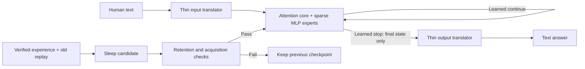

# Premonition: end-to-end execution board

Started 2026-09-30 02:32 UTC (September 29, 10:32 p.m. New York).
Owner: lead coordinator. Implementation and experiments: Sol subagents.

The complete objective is **NOT SHOWN**. This board does not promote development
screens or carry old approvals forward. The user's current design and evidence
rules override older handoff notes.

## Deadline update from Ben

Deliver a runnable joined **proof of concept by 2026-09-30 07:00 America/New_York
(11:00 UTC)**. The heart is a non-English latent-state looped reasoner, notebook,
and actual overnight learning. This version deadline does not imply completion
of the full research proof or public benchmark race. Build and run the vertical
path first; retain every unpassed research gate explicitly. The lead directs and
verifies Sol work, rather than absorbing implementation from the workers.

Ben confirms his RTX 5070 Ti is reachable through Tailscale. Prefer that free
GPU for small tests. $7.50 is the total rental budget for this proof of concept;
additional funding comes after delivery. At account usage below 3% remaining,
Ben authorizes applying his available reset through supported account controls.
Initial usage check: 76% remaining, one full reset available; not redeemed.

### Release checks for the 7 a.m. version

1. A documented local command loads actual saved weights and accepts text.
2. The reasoner loops in latent state, uses a learned stop with an enforced cap,
   and passes only final state to the output translator. No language-model or
   hand-written solver silently substitutes for the reasoner.
3. A persistent notebook reaches the reasoner; the output translator cannot read
   it independently. A memory-removal control establishes whether it is used.
4. A real sleep job updates a checkpoint using allowed experience and replay;
   fresh before/after checks record new competence and old-skill retention.
   Failed candidates roll back. No gain is promised ahead of the run.
5. Two seeds and independent recount back any claimed behavioral improvement.
   A working interface alone is labelled an engineering result.
6. One model bundle, a run guide, raw evidence and a visual status report are
   committed to main. Scope limits and all failed gates remain prominent.

Ben clarified: **grammatically correct conversational sentences are required**;
symbolic-only input/output is not the requested version. Beating other models on
equal benchmarks for its scale is also a target. The comparison must disclose
the whole system's total and active parameters, including any pretrained language
component, and equal inputs/tools/budgets. A pretrained talker must not bypass
the latent reasoner. Unsupported wins or grammatical examples alone do not pass.

An overnight heartbeat is scheduled every 15 minutes in this chat to resume
coordination if needed and report meaningful changes. It must report readiness
and any unmet requirements by the deadline, then pause its recurring schedule.

## Design and stage order

| Stage | Required evidence | Current status | Work now |
|---|---|---|---|
| 1. Components | Qualified dense reference; 2× reasoning, full few-shot ladder and half time-to-quality; stop before sleep; composition; frozen-state translator and failing controls; many nights/kinds | NOT SHOWN | Six Sol work lanes below |
| 2. Joined model | Real text → learned loop → final-state text; improvement after sleep, using the same joined weights | NOT SHOWN | Build interfaces; no substitute-rule demonstration counts |
| 3. Scale | Gains against fair plain/dense controls persist or grow across sizes and both seeds | NOT SHOWN | Wait for stage 1/2 survivor; measure compute before rental |
| 4. Public race | Locked public-benchmark protocol against open 1–2B models; contamination/provenance audit | NOT SHOWN | Final evaluations remain unopened |
| 5. Assistant | Usable general chat, auditable conversations and nightly sleep; user-supplied sealed test | NOT SHOWN | Capture/runtime scaffolding only; never access uncle questions |

## Active Sol lanes

| Lane | Worker | New files owned | Deliverable / dependency |
|---|---|---|---|
| Compute | Noether | artifacts/sol-ops-20260929, scripts/sol_ops_* | Live queue health, available compute, cheapest priced launch and cleanup plan |
| Spatial diagnosis | Peirce | artifacts/sol-spatial-20260929, scripts/sol_spatial_* | Two-seed +1 GRU gate-bias test, unchanged and dense controls; diagnostic, not adoption of a GRU target |
| Stop | Epicurus | artifacts/sol-stop-20260929, scripts/sol_stop_* | Actual active-row stopping, final-state contract, TRAIN-only calibration and parity |
| Composition | James | artifacts/sol-compose-20260929, scripts/sol_compose_* | Learned cross-program communication, fresh symbolic compositions, fair controls |
| Translator | Leibniz | artifacts/sol-translator-20260929, scripts/sol_translator_* | Final-state-only frozen decoder; embedding-only/no-state/shuffled/plain controls; provenance audit |
| Sleep / runtime | Bernoulli | artifacts/sol-sleep-20260929, scripts/sol_sleep_* | Multiple kinds/nights, replay provenance, rollback, assistant interface; training waits on stop evidence |

Concurrency limit is six. An independent blind recount uses the next available
Sol slot. It receives raw scored records and presealed marks only, without the
author's result narrative. No new scientific claim is accepted before that audit.

## Acceptance and experiment discipline

- Read the latest local review and retain all failed runs. Never reopen or rescore
  a consumed holdout. Recount saved correctness records without running inference.
- Seal source and checkpoint hashes, generator/split identity, seed list,
  comparator, measured-noise provenance, pass marks and full work budgets before
  each run. If noise is unavailable, a diagnostic run cannot earn SHOWN.
- The original ladder is k=1/4/16/64/256/1024/4096/16384, with 2,048 adaptation
  updates per rung. F_few uses the first four rungs. Reduced-budget pilots must
  not be compared as though they ran that protocol.
- Use the qualified width-256, two-block, 1,645,726-parameter dense reference,
  relevant improved dense comparators and plain-network controls. Match inputs,
  presentations and active work; charge replay, prefix, router, teacher, stop
  fitting, interrupted work and search. Storage alone is not a cost objection.
- The 2× reasoning criterion is ceiling-aware (double accuracy below 50%; halve
  errors above 50%), with useful absolute quality when the control is near zero.
  Full details remain in the latest review's PROOF_PROTOCOL.md; final confirmation
  needs new independent families, both seeds, and uncertainty/multiplicity checks.
- Architecture fidelity is separate from performance: whole-program top-one
  isolation is not cross-program composition; a GRU diagnostic is not the target
  recurrent attention/MLP MoE; zero-state failure alone does not exclude decoder
  reasoning from retained input.
- No model-authored text, paraphrase or template enters training. Algorithmically
  generated symbolic tasks are labelled as such, not as natural-language proof.
  Logged assistant messages are excluded from training labels.
- Downstream software can be built in parallel. Stage proof and dependent
  training cannot skip upstream gates. Sleep training follows stop readiness.

## Money and machines

Tonight's total Vast authorization: **$7.50**. New committed spend: **$0.00**.
The earlier per-spend approval rule (ask for $0.50 or more, including cost and a
cheaper option) remains in effect. No rental is launched until the job is ready,
priced and authorized. Mac jobs use handoff/queue; use pcqueue only if an available
PC is verified. Old jobs, other agents' rentals and sealed files are preserved.

Every approved rental must log price, instance ID, hard runtime/spend cutoff,
copy-back checksums and verified destruction. Do not split a larger commitment
into small rentals to evade approval.

## Initial review findings (not new experimental proof)

The read of `program_library.py` confirms a fixed route chosen during embed and
one selected program per loop. Its own counts report composition=false. The
spatial and numeric candidates use GRUCell recurrence. `real_screen.py`'s old
evaluation runs the full cap before selecting a stop: its time is not active-stop
latency. These code observations guide the new tests; historical scores remain
development evidence unless their specific seal and independent audit qualify
them. No final panel was opened during this takeover.

Sources: handoff/director-roadmap.md; handoff/director-board.md;
handoff/director-briefs/thread-helper-common.md;
reviews/premonition-moe-2026-09-29/{README,REPORT,PROOF_PROTOCOL}.md;
artifacts/claude-fewex-20260927/RESULTS-EQ.md.
